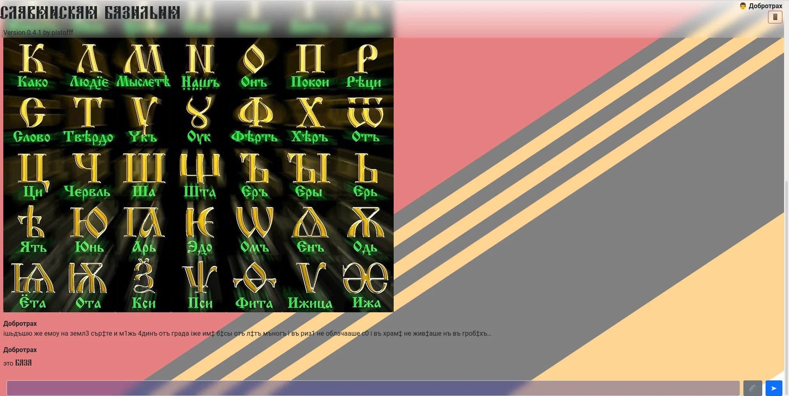

# СЛАВЯНСКИЙ ЧАТ
Браузерный чат, написанный с использованием express.js и WebSockets, поддерживает Markdown, загрузку изображений (в том числе анимированных), регистрацию с сохранением паролей в виде Blake3 хэшей. Клиент не использует сторонние зависимости.

